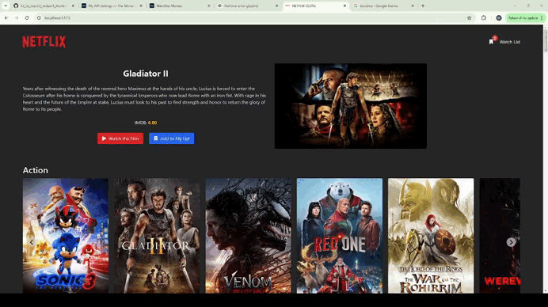

# Netflix Clone Project 
🎥 This project is another new example of using classic redux, react-redux and redux-thunk. 
With this project I deepened my understanding of state management and middleware by activating the feature of adding and removing movies listed on the homepage 
# Preview of the Project 

